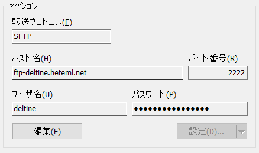

# svelte-plain-php5.6-example

フロントエンドを[Svelte][:svelte:]、バックエンドをプレーンなPHPで作成したサンプルです。

## 概要

以下の学習を目的にしたシンプルな実装を心掛けました。
簡単のためセキュリティを考慮した実装は避けました。

- フロントエンドとバックエンドの分離方法
- CORS対策
- ログイン機能
- ページネーション機能
- メール送信
- プライベート画面(ログインしたアカウントのみアクセス可能な画面)

## 何故、Reactではなく、Svelteを使うんですか？

[Svelte][:svelte:]はコード量が少なく、直観的です。バンドルサイズも小さくなり、高速なようです。

## 何故、プレーンなPHP5.6を使うんですか？

格安のレンタルサーバーでフレームワークも使えない場合等、過酷なインフラ環境を想定しました。apacheでmod-rewriteが禁止されているとほぼフレームワークが使えません。使いたいような、使いたくないような、[そんなレンタルサーバー][:mugen:]があるんです。

## インストール

### サーバ起動

```bash
cd svelte-plain-php5.6-example
docker-compose up -d
```

### データベース

データベースにMySQL Workbench等で接続

```bash
Hostname:       127.0.0.1:3307
Username:       root
Password:       password
Default Schema: mydb
```

以下のテストデータを登録

```bash
cd .doc
code .doc/DDL_DML.sql
```

### Node.jsのインストール

Node.jsのインストールは[こちら][:nodejs:]

pnpmのインストールは[こちら][:pnpm:]※必須ではありません

```bash
npm install -g pnpm
```

#### Visual_Studio_Codeでnpmコマンドがエラーとなる場合

RestrictedからRemoteSignedへ変更

```bash
Get-ExecutionPolicy
Set-ExecutionPolicy RemoteSigned
Get-ExecutionPolicy
```

### フロントエンド(App)起動

```bash
cd project/frontend/app
pnpm i
pnpm run dev
```

### フロントエンド(Home)起動

```bash
cd project/frontend/home
pnpm i
pnpm run dev
```

### テスト用のホスト名を登録

hostsファイルを開く
※必須の工程です
※Visual Studio Codeを管理者で開くと修正可能

```bash
code C:/Windows/System32/drivers/etc/hosts
```

以下のテスト用ホストを追加

```bash
127.0.0.1       example-home.jp
127.0.0.1       example-app.jp
127.0.0.1       example-php.jp
```

### 実行

```bash
https://example-app.jp/
https://example-home.jp/
https://example-php.jp/
```

## 実装

### フロントエンドとバックエンドの分離方法

1. プロジェクトをサーバーへ仮置き
   以下のフォルダへ配置

   ```bash
   /project/frontend/home
   /project/frontend/app
   /project/backend/php
   ```

   ※docker-compose.ymlを参照

   ```bash
   code docker-compose.yml
   ```

2. デプロイ先フォルダのリンクをapacheの各ディレクトリへ作成
   以下、リンクコマンドをDockerfileから抜粋

   ```bash
   ln -s /project/frontend/home/public /var/www/html/example-home.jp
   ln -s /project/frontend/app/public /var/www/html/example-app.jp
   ln -s /project/backend/php/public /var/www/html/example-php.jp
   ```

   ※Dockerfileを参照

   ```bash
   code .infra/docker/php/Dockerfile
   ```

### CORS対策

リクエストの応答やセッション情報はドメイン([オリジン][:Origin:])が異なる場合、フロンドエンドとバックエンドに設定をしなければ想定通りの動作が行われない。また、[CORS][:cors:]環境でセッション情報をやり取りする場合「SSL通信が必須」となります。[https-portal][:https-portal:]でオレオレ証明書を発行しローカル環境で開発を可能としています。

#### フロンドエンド

fetch時に「credentials: "include",」を設定

```bash
const res = await fetch("https://example-php.jp/loginUser.php", {
    method: "POST",
    headers: { "Content-Type": "application/json" },
    body: JSON.stringify({ username: userNameLocal }),
    credentials: "include",
});
```

※LoginCheck.svelteを参照

```bash
code project/frontend/app/src/routes/LoginCheck.svelte
```

#### バックエンド

冒頭で以下の設定を行う

```bash
header("Access-Control-Allow-Origin: https://example-app.jp");
header("Access-Control-Allow-Methods: GET, POST, OPTIONS, PUT, DELETE");
header("Access-Control-Allow-Headers: Content-Disposition, Content-Type, Content-Length, Accept-Encoding");
header("Access-Control-Allow-Credentials: true");
header('Context-Type: application/json');
```

セッション開始は[php5.6の仕様][:php:]通りです。ソースを抜粋し記載します。

```bash
$maxlifetime = 6000;
session_set_cookie_params($maxlifetime, '/; SameSite=None', '', true);

session_start();
session_regenerate_id();
session_write_close();
```

※loginUser.phpを参照

```bash
code project/backend/php/public/loginUser.php
```

### ログイン機能

phpでセッションを作成し、ログイン後に作成したセッション情報を確認し、ログイン有無を判断します。厳密な実装ではないので詳細はソースを参照ください。

ログイン(loginUser.php)

```bash
code project/backend/php/public/loginUser.php
```

ログイン確認(loginCheck.php)

```bash
code project/backend/php/public/loginCheck.php
```

ログアウト(logout.php)

```bash
code project/backend/php/public/logout.php
```

### ページネーション機能

商品等をリスト表示する際のページング処理の実装です。フレームワークを使えないことによる弊害です。車輪の再発明は極力控えたい所です。

※Pagination.svelteを参照

```bash
code project/frontend/app/src/routes/Pagination.svelte
```

### メール送信

sendmailを使用しています。以下のURLでメールを送信します。

```bash
https://example-php.jp/loginCheck.php
```

[mailhog][:MailHog:]を使用しローカル環境のメールボックスを確認します。

```bash
http://localhost:8025
```

### プライベート画面

ログイン画面で「login」ボタンを押下します。

```bash
https://example-app.jp/loginCheck
```

プライベート画面が開けるか確認します。

```bash
https://example-app.jp/private
```

## デプロイ

どこにでもデプロイできる方法にこだわり、レンタルサーバーにデプロイできれば大体の環境で応用が利くと考えました。そこで[WinSCP][:WinSCP:]のCUIコマンドでデプロイバッチを作成する事にしました。

### レンタルサーバーの登録

無料期間がある[レンタルサーバー][:heteml:]を契約しました。

### ドメイン取得

[お名前.com][:onamea:]等でドメインを取得

```bash
example2022.xyz
```

### レンタルサーバーへドメインを登録

取得したドメインを設定し、以下のサブドメインを作成しました。

```bash
app.example2022.xyz (フロントのアプリページ用)
home.example2022.xyz (フロントのホームページ画面用)
php.example2022.xyz (バックエンドのpublicなAPI用)
```

### WinSCPのインストール

ダンロードは[こちら][:WinSCPDL:]
使い方は割愛します。

### WinSCPの接続情報の登録

接続情報例


### deploy.batの編集

SESSION、XXX_LOCAL、XXX__REMOTE変数を適宜変更

```bash
code .deploy/deploy.bat
```

### PHPのデプロイ前準備

PHPのデプロイ対象がpublicなソースとprivateなソース(環境変数やdatabaseアクセスクラス等)が混じっているので、サーバーのprivateな場所にデプロイし、publicなソースをサーバーのpublicな場所へリンク作成します。

```bash
ln -s /home/users/0/deltine/php /home/users/0/deltine/web/example2022.xyz/php
```

### deploy.bat実行

```bash
.deploy/deploy.bat
```

[:svelte:]:         https://svelte.jp/
[:nodejs:]:         https://nodejs.org/ja/
[:pnpm:]:           https://pnpm.io/installation
[:mugen:]:          http://mugenserver.jp/
[:https-portal:]:   https://github.com/SteveLTN/https-portal
[:php:]:            https://www.php.net/manual/ja/ref.session.php
[:cors:]:           https://developer.mozilla.org/ja/docs/Web/HTTP/CORS
[:Origin:]:         https://developer.mozilla.org/ja/docs/Glossary/Origin
[:MailHog:]:        https://github.com/mailhog/MailHog
[:WinSCP:]:         https://winscp.net/eng/docs/lang:jp
[:WinSCPDL:]:       https://forest.watch.impress.co.jp/library/software/winscp/
[:onamea:]:         https://www.onamae.com/
[:heteml:]:         https://admin.heteml.jp/
